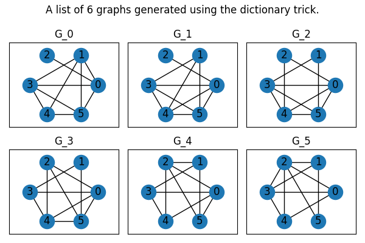

# Dictionary Trick
The dictionary trick generates a temporal network trajectory by taking an initial network $G_0$ and performing unique rewirings, that were not yet performed in the trajectory to generate new networks $G_i$.

Each $G_i$ is obtained by performing 1 rewiring of $G_{i-1}$.

